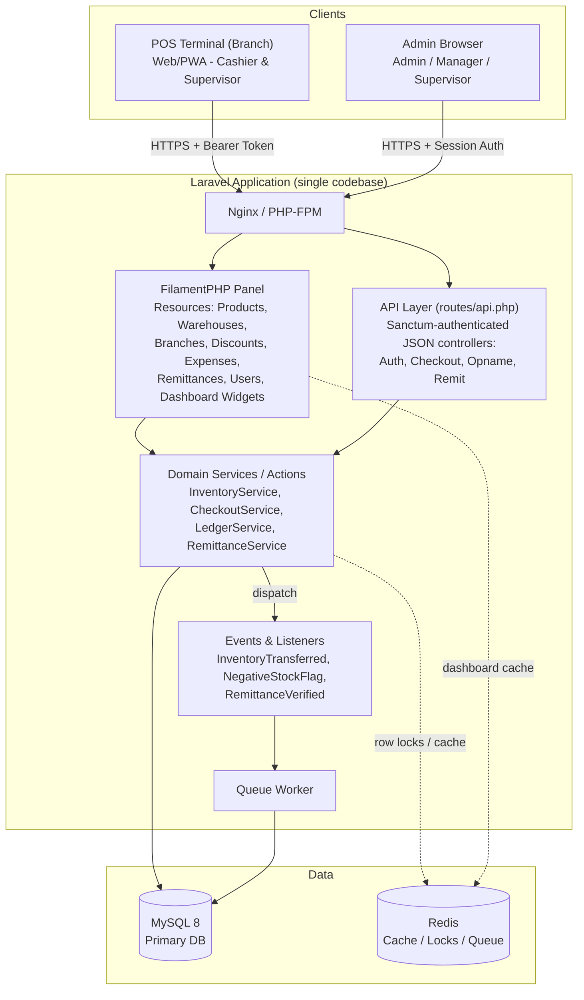
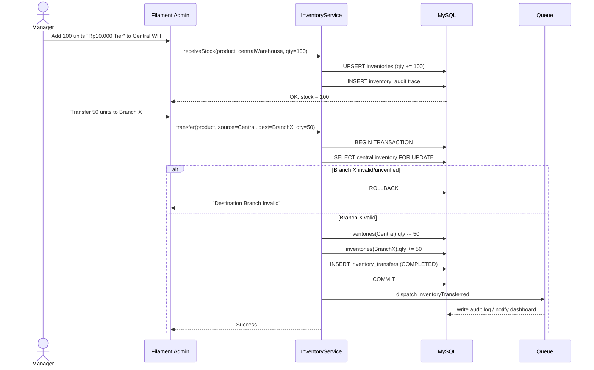
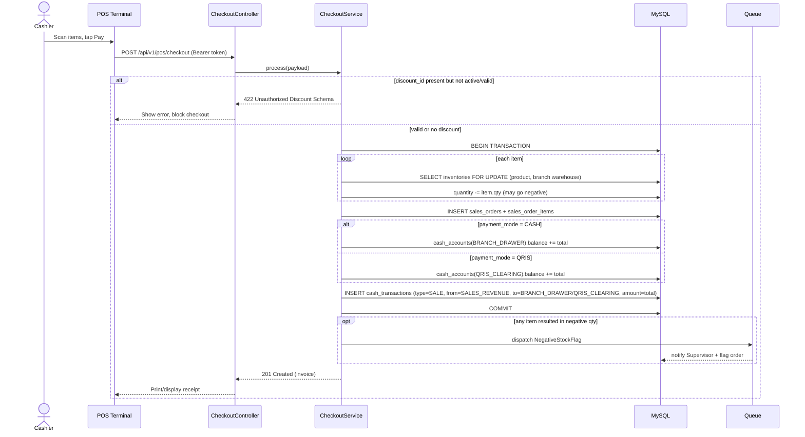
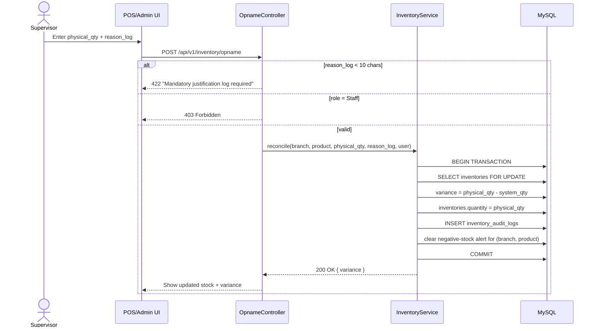
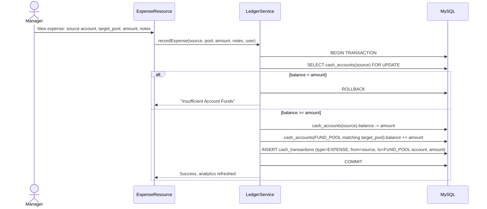
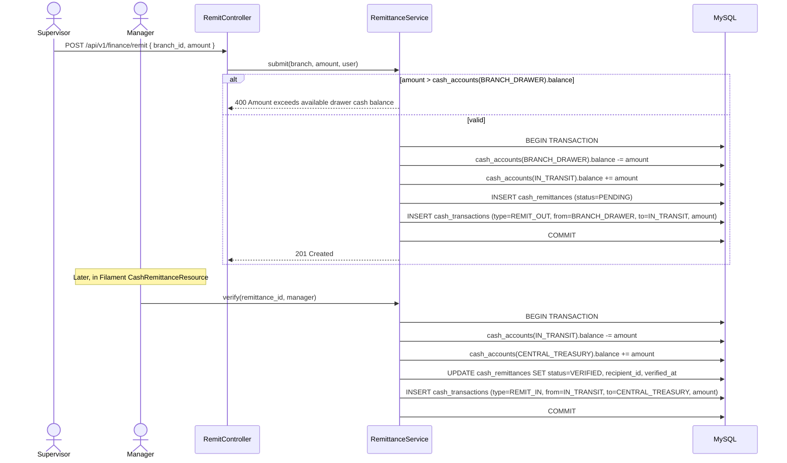

# [RFC] Gerai Masjid ERP (GM ERP) — Technical Design

| Field | Value |
|---|---|
| **Status** | RFC |
| **Owner** | Fitra Aditya |
| **Submitted Date** | 2026-07-17 |
| **Approver** | APPROVED |
| **Related Documents** | [PRD.md](./PRD.md) — Gerai Masjid ERP Product Requirements |

---

## 1. Overview

GM ERP replaces spreadsheet-based operations for Sedekah Baju Bogor with a single Laravel application exposing two front doors:

1. **Back-Office Admin Panel** (FilamentPHP) — used by Admin, Manager, Supervisor for master data, inventory control, finance, and dashboards.
2. **POS JSON API** (Laravel + Sanctum) — used by branch/storefront POS terminals (cashiers) for checkout, stock opname submission, and cash remittance requests.

Both surfaces share one MySQL database and one domain service layer, so business rules (negative-stock policy, fund-pool routing, role gating) are enforced once, not duplicated between the admin panel and API.

### Success Criteria

Mapped from PRD §2 Objectives:

- **Inventory accuracy:** 100% real-time inventory sync between system and physical branch stock, replacing 0%/manual end-of-month reconciliation.
- **Ledger latency:** Cash/expense entries post in real time on checkout or manager expense logs, replacing the current 3–5 business day spreadsheet compilation lag.
- **Dashboard visibility:** Zero manual file compilation for branch or global views — Admin/Manager get an aggregate dashboard, Supervisor gets an auto-scoped single-branch view.
- **Checkout resilience:** POS checkout never blocks on stock-sync delay — negative stock is allowed and automatically flagged for Supervisor reconciliation instead of stalling the sale.
- **Financial auditability:** Every cash movement (sale, expense, remittance) is traceable to a ledger row and an actor — no unrecorded cash handling.

### Out of Scope

- SMS/WhatsApp donor transaction notifications (PRD: deferred to Phase 2).
- Multi-currency ledger conversions (IDR only).
- POS offline mode / local queue with background sync — **Phase 1 is online-only** (decided 2026-07-17, see §5). Outage fallback is an operational procedure (manual paper record, re-entered into POS once connectivity returns), not a system feature.
- Automated general-ledger asset write-off when an opname resolves a negative-stock position (decided 2026-07-17, see §5). Correction is via the Supervisor Opname flow only.
- A formal multi-line journal (`journal_entries`/`journal_lines`) — not needed until a single financial event must fan out across 3+ accounts; current scope only has two-party movements (see §2 Ledger Mechanics).

### Related Documents

- [PRD.md](./PRD.md) — source product requirements, including the five RFC-readiness user stories and the initial schema/API hooks this design formalizes.

### Assumptions

- Single Laravel monolith is acceptable at current scale (a handful of branches + bursty bazaar-event traffic, not sustained high QPS). Revisit only if branch count grows materially.
- POS terminals have live internet connectivity during normal operating hours; full offline support is deferred to Phase 2.
- Cashier maps to a `STAFF` role with an individual login account (confirmed with stakeholders 2026-07-17) — the PRD's own schema table omitted `STAFF` from the role enum; this RFC adds it.
- A single-table double-entry ledger (§2 Ledger Mechanics) is sufficient for MVP financial reporting; a full multi-line journal is not required yet (confirmed 2026-07-17).
- One global `SALES_REVENUE` ledger account is sufficient for MVP; per-branch revenue accounts are not required yet (open item, see §5).

### Dependencies

- **Authentication Gateway:** Laravel Sanctum token issuance/validation to identify POS terminal devices and enforce role-based routes (PRD §5 DEP).
- **Database Transaction Locks:** MySQL row-level locking (`SELECT ... FOR UPDATE`) to prevent overselling during concurrent checkout bursts (PRD §5 DEP).
- **Redis:** cache for dashboard aggregates, queue backend, supplementary atomic locks.
- **Filament Shield (Spatie permissions):** role/permission enforcement backing the matrix in §2.
- **Laravel Queue worker infrastructure:** required for async domain events (`InventoryTransferred`, `NegativeStockFlag`) so checkout latency isn't coupled to audit/notification writes.

---

## 2. Technical Design

### Architecture & Tech Stack

| Layer | Choice | Why |
|---|---|---|
| Framework | Laravel 11 | Fast MVP delivery, mature ORM/transactions/queue primitives needed for row-locking and events. |
| Admin UI | FilamentPHP 3 | PRD explicitly requires a FilamentPHP back-office; gives CRUD + RBAC + dashboards with minimal custom frontend work inside a 1-month budget. |
| RBAC | Filament Shield (Spatie permissions) | Maps directly to PRD's roles (Admin/Manager/Supervisor/Staff) and per-module permission blocks in the User Stories. |
| Database | MySQL 8 | Matches team preference; supports row-level locking, JSON columns, generated columns for variance calc. |
| API Auth | Laravel Sanctum | Lightweight token auth for POS terminal devices, scoped per branch. |
| Async/Events | Laravel Queue + Events/Listeners | Implements `InventoryTransferred` and `NegativeStockFlag` as first-class domain events without blocking checkout latency. |
| Cache/Locks | Redis | Dashboard aggregate cache; backs Laravel's atomic lock helper as a second line of defense around checkout hot paths. |



**Key architectural decisions:**
- **Single Laravel monolith**, not separate microservices — matches the 1-month MVP timeline and avoids distributed-transaction complexity for stock/ledger consistency, which needs to be atomic.
- **Domain Services shared by both entry points.** `CheckoutService`, `InventoryService`, `LedgerService`, `RemittanceService` contain all business rules; Filament actions and API controllers are thin wrappers calling the same services, guaranteeing identical behavior regardless of which surface triggered the action.
- **Events are queued, not synchronous**, for anything that isn't required to compute the response (audit trail writes for transfers, Supervisor alert on negative stock, dashboard cache busting) — keeps checkout latency independent of side-effect processing.

#### Module Breakdown

| Module | Filament Resource(s) | API Endpoint(s) | Domain Service |
|---|---|---|---|
| Master Data | `ProductResource`, `WarehouseResource`, `BranchResource`, `UserResource` | — | — |
| Inventory Intake & Transfer | `InventoryResource` (+ custom "Transfer to Branch" action) | — | `InventoryService::receiveStock()`, `InventoryService::transfer()` |
| POS Checkout | (read-only order log view) | `POST /api/v1/pos/checkout` | `CheckoutService::process()` |
| Stock Opname | `InventoryAuditResource` (approval view) | `POST /api/v1/inventory/opname` | `InventoryService::reconcile()` |
| Discounts | `DiscountResource` | — | — (read-only lookup at checkout) |
| Expense / Ledger | `ExpenseResource`, `CashAccountResource` (read) | — | `LedgerService::recordExpense()` |
| Cash Remittance | `CashRemittanceResource` (verify action) | `POST /api/v1/finance/remit` | `RemittanceService::submit()`, `RemittanceService::verify()` |
| Dashboard | Filament Widgets (`InventoryHealthWidget`, `CashPositionWidget`, `SalesTrendWidget`) scoped by role | `GET /api/v1/dashboard/summary` | `DashboardService::summarize()` |
| Financial Reports (Chart of Accounts) | `FinancialReports` page (Admin/Manager only) — trial balance + period P&L | — | `LedgerReportService::trialBalance()`, `LedgerReportService::profitAndLoss()` |
| Purchasing (Supplier + PO) | `SupplierResource`, `PurchaseOrderResource` (+ custom "Receive"/"Record Payment"/"Cancel" actions) | — | `PurchaseOrderService::create()`, `PurchaseOrderService::receive()`, `PurchaseOrderService::recordPayment()`, `PurchaseOrderService::cancel()` |
| Auth | Filament login (session) | `POST /api/v1/auth/login` (Sanctum token issuance) | — |

#### Roles & Permission Matrix

| Module / Action | Admin | Manager | Supervisor | Staff (Cashier) |
|---|:---:|:---:|:---:|:---:|
| Product & Central Warehouse intake (Story 1) | ✅ | ✅ | ❌ | ❌ |
| Inventory transfer to branch (Story 1) | ✅ | ✅ | ❌ | ❌ |
| POS Checkout (Story 2) | ✅ | ✅ | ✅ | ✅ |
| Apply discount at checkout (validated only) | ✅ | ✅ | ✅ | ✅ |
| Stock Opname submission (Story 3) | ✅ | ✅ | ✅ | ❌ |
| Expense entry / fund-pool routing (Story 4) | ✅ | ✅ | ❌ | ❌ |
| Cash remittance — submit (Story 5) | ✅ | ✅ | ✅ | ❌ |
| Cash remittance — verify (Story 5) | ✅ | ✅ | ❌ | ❌ |
| Global dashboard (all branches) | ✅ | ✅ | ❌ | ❌ |
| Single-branch dashboard | ✅ | ✅ | ✅ (own branch only) | ❌ |
| User & role management | ✅ | ❌ | ❌ | ❌ |
| Financial Reports (Trial Balance / P&L) | ✅ | ✅ | ❌ | ❌ |
| Supplier & Purchase Order management | ✅ | ✅ | ❌ | ❌ |

Implemented via Filament Shield policies + a `branch_id` scope on Supervisor/Staff queries (global scope applied when `role != ADMIN/MANAGER`).

### Sequence

#### Story 1 — Central Intake & Branch Transfer



#### Story 2 — POS Checkout (negative stock allowed)



#### Story 3 — Stock Opname & Variance Auditing



#### Story 4 — Expense Entry & Fund Pool Routing



#### Story 5 — End-of-Day Cash Remittance (Setoran Kas)



### Database Model

The PRD's "Schema Change Tables" (§5) is the contractual minimum. This RFC expands it with the tables needed to make the described behavior actually work (transfers, discounts, cash accounts, remittance) — additions are marked **(RFC addition)**.

```mermaid
erDiagram
    USERS ||--o{ SALES_ORDERS : "cashiers"
    USERS ||--o{ INVENTORY_AUDIT_LOGS : "performs"
    USERS ||--o{ CASH_REMITTANCES : "submits"
    USERS ||--o{ CASH_REMITTANCES : "verifies"
    USERS ||--o{ INVENTORY_TRANSFERS : "initiates"
    USERS ||--o{ CASH_TRANSACTIONS : "records"
    USERS }o--|| BRANCHES : "assigned_to"

    WAREHOUSES ||--o{ INVENTORIES : "holds"
    WAREHOUSES ||--o| BRANCHES : "maps_to"
    WAREHOUSES ||--o{ INVENTORY_TRANSFERS : "source"
    WAREHOUSES ||--o{ INVENTORY_TRANSFERS : "destination"

    PRODUCTS ||--o{ INVENTORIES : "stocked_as"
    PRODUCTS ||--o{ INVENTORY_TRANSFERS : "moved"
    PRODUCTS ||--o{ INVENTORY_AUDIT_LOGS : "audited"
    PRODUCTS ||--o{ SALES_ORDER_ITEMS : "sold_as"

    BRANCHES ||--o{ SALES_ORDERS : "hosts"
    BRANCHES ||--o{ INVENTORY_AUDIT_LOGS : "location"
    BRANCHES ||--o{ CASH_REMITTANCES : "originates"
    BRANCHES ||--o{ CASH_ACCOUNTS : "owns_drawer"

    DISCOUNTS ||--o{ SALES_ORDERS : "applied_to"

    SALES_ORDERS ||--o{ SALES_ORDER_ITEMS : "contains"
    SALES_ORDERS ||--o{ CASH_TRANSACTIONS : "generates"

    CASH_ACCOUNTS ||--o{ CASH_TRANSACTIONS : "source"
    CASH_ACCOUNTS ||--o{ CASH_TRANSACTIONS : "destination"

    CASH_REMITTANCES ||--o{ CASH_TRANSACTIONS : "settles"

    USERS {
        uuid id PK
        string name
        string email
        string password
        enum role "ADMIN, MANAGER, SUPERVISOR, STAFF"
        uuid branch_id FK "nullable, null for Admin/Manager"
        timestamp created_at
    }

    WAREHOUSES {
        uuid id PK
        string name
        enum type "CENTRAL, BRANCH"
        string address
        timestamp created_at
    }

    BRANCHES {
        uuid id PK
        string name
        uuid warehouse_id FK
        string address
        string phone
        enum status "ACTIVE, INACTIVE"
        timestamp created_at
    }

    PRODUCTS {
        uuid id PK
        string sku UK
        string name
        text description
        decimal price_tier "12,2"
        decimal cost_price "12,2 - nullable, RFC addition (COGS/margin reporting)"
        string category
        timestamp created_at
    }

    INVENTORIES {
        uuid id PK
        uuid product_id FK
        uuid warehouse_id FK
        int quantity "signed, can be negative"
        timestamp updated_at
    }

    INVENTORY_TRANSFERS {
        uuid id PK "RFC addition"
        uuid product_id FK
        uuid source_warehouse_id FK
        uuid destination_warehouse_id FK
        int quantity
        enum status "COMPLETED, CANCELLED"
        uuid initiated_by FK
        timestamp created_at
    }

    INVENTORY_AUDIT_LOGS {
        uuid id PK
        uuid branch_id FK
        uuid product_id FK
        int system_qty
        int physical_qty
        int variance "generated: physical_qty - system_qty"
        uuid user_id FK
        text reason_log
        timestamp created_at
    }

    DISCOUNTS {
        uuid id PK "RFC addition"
        string name
        string code UK
        enum type "PERCENTAGE, FIXED"
        decimal value "12,2"
        boolean is_active
        datetime starts_at
        datetime ends_at
        timestamp created_at
    }

    SALES_ORDERS {
        uuid id PK
        uuid branch_id FK
        uuid cashier_id FK "RFC addition"
        uuid discount_id FK "nullable"
        enum payment_mode "CASH, QRIS"
        decimal total_price "12,2"
        decimal cogs_total "12,2 - RFC addition (COGS/margin reporting)"
        decimal gross_profit "12,2 - RFC addition, = total_price - cogs_total"
        boolean has_negative_stock_flag "RFC addition"
        timestamp created_at
    }

    SALES_ORDER_ITEMS {
        uuid id PK
        uuid order_id FK
        uuid product_id FK
        int quantity
        decimal unit_price "12,2"
        decimal subtotal "12,2 - RFC addition"
        decimal unit_cost "12,2 - RFC addition, snapshot of product.cost_price at sale time"
        decimal cost_subtotal "12,2 - RFC addition"
    }

    CASH_ACCOUNTS {
        uuid id PK "RFC addition"
        string name
        enum type "CENTRAL_TREASURY, BRANCH_DRAWER, QRIS_CLEARING, FUND_POOL, IN_TRANSIT, REVENUE"
        enum pool_type "HR, OPS, DEV, DISC - nullable, only for FUND_POOL"
        uuid branch_id FK "nullable, only for BRANCH_DRAWER"
        decimal balance "12,2 - for FUND_POOL/REVENUE this is a running total, not spendable cash"
        timestamp updated_at
    }

    CASH_TRANSACTIONS {
        uuid id PK
        uuid order_id FK "nullable"
        uuid remittance_id FK "nullable - RFC addition"
        uuid from_account_id FK "money leaves this account"
        uuid to_account_id FK "money enters this account"
        enum type "SALE, EXPENSE, REMIT_OUT, REMIT_IN"
        decimal amount "12,2 - single amount, always balanced from->to"
        string description
        uuid created_by FK
        timestamp created_at
    }

    SUPPLIERS {
        uuid id PK "RFC addition (Phase 3 Purchasing follow-up)"
        string name
        string contact_person
        string phone
        string email
        text address
        boolean is_active
        timestamp created_at
    }

    PURCHASE_ORDERS {
        uuid id PK "RFC addition (Phase 3 Purchasing follow-up)"
        uuid supplier_id FK
        uuid warehouse_id FK "destination — Central per Story 1 convention"
        uuid created_by FK
        enum status "ORDERED, PARTIALLY_RECEIVED, RECEIVED, CANCELLED"
        decimal subtotal "12,2 - full ordered value"
        decimal total "12,2"
        decimal received_total "12,2 - value of goods actually received so far"
        decimal amount_paid "12,2"
        decimal balance_due "12,2 - received_total - amount_paid"
        json items "[{product_id, quantity_ordered, unit_cost, quantity_received}] - same JSON-blob convention as orders.items, not a normalized line-items table"
        timestamp ordered_at
        timestamp received_at "nullable"
        timestamp created_at
    }

    SUPPLIERS ||--o{ PURCHASE_ORDERS : "supplies"
    WAREHOUSES ||--o{ PURCHASE_ORDERS : "destination"

    CASH_REMITTANCES {
        uuid id PK "RFC addition table, fields per PRD Story 5"
        uuid branch_id FK
        decimal amount "12,2"
        enum status "PENDING, VERIFIED"
        uuid submitted_by FK
        uuid recipient_id FK "nullable"
        timestamp submitted_at
        timestamp verified_at "nullable"
    }
```



#### Notes on schema decisions

- **`inventories.quantity` is signed** and has **no** `CHECK >= 0` constraint — this is the mechanism that implements PRD Story 2 (negative stock must be allowed). Enforcing the floor lives in application logic (there is none — it's explicitly allowed), not the DB.
- **`inventory_transfers`** is new versus the PRD's schema hooks table. The PRD only modeled `inventories` (a point-in-time snapshot per warehouse) but Story 1's acceptance criteria requires an "immutable audit trace" and a `InventoryTransferred` event — that needs its own ledger-style table, not just mutating `inventories.quantity`.
- **`discounts`** is new. Story 2 says checkout must validate `discount_id` against "an active promo configuration established by central Admins" — that configuration has to live somewhere; PRD's schema hooks never defined it.
- **`cash_accounts`** is new and is the backbone of the Ledger Mechanics below. The PRD's `cash_transactions` table references `source_cash_id` and `cash_drawer_balance` / "central QRIS clearing account balance" / fund pools in prose, but never defines the accounts table those foreign keys and named balances point to.
- **`cash_remittances`** is new as a table — the PRD defines the fields for Story 5 in prose (`remit_id`, `branch_id`, `amount`, `status`, `recipient_id`) but omits it from the formal "Schema Change Tables" list. This RFC formalizes it.
- **`cash_transactions` deviates from the PRD's literal schema hooks.** PRD's version has `source_cash_id` + `target_pool` + separate `debit`/`credit` decimal columns on one row (ambiguous about the counterparty account). This RFC replaces it with `from_account_id` / `to_account_id` (both required) + a single `amount` — every money movement names both accounts it touches (see Ledger Mechanics below).
- **`users.role`** adds `STAFF` — the PRD's formal schema table only lists `ADMIN, MANAGER, SUPERVISOR`, but Story 2's Business Logic explicitly grants checkout permission to "Staff (Cashier)". Confirmed with stakeholders 2026-07-17.
- **`products.cost_price` / `orders.cogs_total` / `orders.gross_profit`** are new (2026-07-31, ERP-gap follow-up). `cost_price` is nullable — donated stock commonly has no acquisition cost, and null reads as Rp0 in margin math rather than an error. `CheckoutService::process()` snapshots `unit_cost` per line at sale time (not a live join to `products.cost_price`) so a later cost edit never rewrites a closed order's historical margin. `InventoryReportService::stockSummary()` gained `value_*_cost` keys (stock valued at cost, alongside the existing retail-priced `value_*`) for inventory-valuation reporting. These are display/reporting-only for now — **no ledger entries are posted for inventory value or COGS yet** (no `INVENTORY_ASSET`/`COGS_EXPENSE` `cash_accounts` rows exist). That lands with the Chart-of-Accounts follow-up, so `receiveStock()`/checkout's ledger posting stay unchanged in this pass.

#### Ledger Mechanics (Fund Pool Routing)

**Design: single-table double-entry ledger.** `cash_accounts` models every named money pool as a row: one `CENTRAL_TREASURY`, one `QRIS_CLEARING`, one `IN_TRANSIT` (remittance clearing), one `BRANCH_DRAWER` per branch, one global `SALES_REVENUE` (type `REVENUE`), and four `FUND_POOL` rows (HR/OPS/DEV/DISC).

Every `cash_transactions` row records exactly one balanced movement: `from_account_id` (money leaves), `to_account_id` (money enters), `amount`. Both accounts are always required — there is no row where money "appears from nowhere" or "disappears with no destination."

| Event | `from_account_id` | `to_account_id` | Effect |
|---|---|---|---|
| Sale (Story 2) | `SALES_REVENUE` | `BRANCH_DRAWER` or `QRIS_CLEARING` | Revenue recognized, cash account credited. |
| Expense (Story 4) | the chosen `source_cash_id` account | `FUND_POOL` account matching `target_pool` | Source cash decreases; pool's balance becomes a **running total of cumulative spend in that category** (not spendable cash) — feeds the "expense analytics charts" the PRD asks for. |
| Remit submit (Story 5) | `BRANCH_DRAWER` | `IN_TRANSIT` | Branch liability moves to a clearing account while pending verification. |
| Remit verify (Story 5) | `IN_TRANSIT` | `CENTRAL_TREASURY` | Confirmed cash lands in treasury. |
| PO receive (Phase 3 Purchasing) | `ACCOUNTS_PAYABLE` | `INVENTORY_ASSET` | Goods received on credit; liability grows (see Chart of Accounts subsection below on why this is the correct from/to direction for a liability in this schema). |
| PO payment (Phase 3 Purchasing) | chosen cash account | `ACCOUNTS_PAYABLE` | Cash decreases, liability shrinks. |

**Why not a full `journal_entries` / `journal_lines` pair (traditional multi-line double-entry)?** Every event in this PRD is a simple two-party movement — nothing requires splitting one transaction across more than two accounts. A single table with `from_account_id`/`to_account_id`/`amount` gives the guarantee that matters most for reporting — every account's balance is fully derivable from the transaction log, and the sum entering an account always equals the sum leaving its counterparties — without the schema/query overhead of a header+lines model. If a future requirement needs one event to fan out across 3+ accounts, that's the trigger to migrate to `journal_entries`/`journal_lines`; nothing in the current PRD requires it. A trial balance report is just `SUM(amount) GROUP BY to_account_id` minus `SUM(amount) GROUP BY from_account_id`.

#### Chart of Accounts (2026-08-01, ERP-gap follow-up, Phase 2 of 4: COGS -> COA -> Purchasing -> Returns)

`cash_accounts` *is* the Chart of Accounts — `CashAccount::ACCOUNT_TYPES` formalizes the five classifications (`asset`/`liability`/`equity`/`revenue`/`expense`) and `CashAccount::normalBalance()` maps each to its GAAP normal-balance side (`asset`/`expense` -> debit, everything else -> credit). This is a *classification* layer over the existing from/to ledger mechanics above, not a replacement — `.balance` is still maintained incrementally by `LedgerService::post()` exactly as before, so it already **is** a live trial balance; `LedgerReportService::trialBalance()` just groups/subtotals it by `account_type`.

Two account types were fixed/added on top of the original seed data:
- **Fund pools (`POOL-HR/OPS/DEV/DISC`) reclassified `equity` -> `expense`.** They only ever receive credit entries (spend), never fund anything back out — that's an expense category, not owner capital. See `2026_08_01_090000_reclassify_fund_pool_accounts_as_expense` migration.
- **`INVENTORY_ASSET` (asset) and `COGS_EXPENSE` (expense) added.** `InventoryService::receiveStock()` gained an *optional* `$fundingSource` parameter — when given (and `products.cost_price` is positive), it posts `from:$fundingSource -> to:INVENTORY_ASSET`. Every existing call site keeps working unchanged since it's opt-in (donated stock has no cost/funding source to post). `CheckoutService::process()` now unconditionally posts `from:INVENTORY_ASSET -> to:COGS_EXPENSE` for `cogs_total > 0` (Phase 1's per-line `unit_cost` snapshot), recognizing the expense against whatever inventory value was built up at receipt. **Known limitation:** if stock was received without a funding source but later sold with a nonzero `cost_price`, `INVENTORY_ASSET` goes negative — same "allow it, don't block the sale" tolerance this system already applies to negative stock quantity, not a bug.

`LedgerReportService::profitAndLoss($periodStart, $periodEnd, ?$warehouseId)` is period-scoped (unlike `.balance`, which is all-time) — it reads `SUM(debit)` on revenue-type accounts and `SUM(credit)` on expense-type accounts (including `COGS_EXPENSE`) from the `ledgers` log directly, per the from/to direction each event actually posts in.

#### Purchasing / Accounts Payable (2026-08-01, ERP-gap follow-up, Phase 3 of 4)

`ACCOUNTS_PAYABLE` (liability) is modeled the same way `SALES_REVENUE` already was: a "source" account whose balance goes more negative as an obligation grows (`PurchaseOrderService::receive()` posts `from:ACCOUNTS_PAYABLE -> to:INVENTORY_ASSET`) and back toward zero as it's settled (`recordPayment()` posts `from:<cash account> -> to:ACCOUNTS_PAYABLE`). This is *not* GAAP credit-increases-a-liability — it's this schema's existing "loses/gains" bookkeeping direction (see Ledger Mechanics above), applied consistently to the one liability account that now exists.

**Don't read `CashAccount::where('code','ACCOUNTS_PAYABLE')->value('balance')` for "how much do we owe."** Same reasoning as `SALES_REVENUE`: that balance is a ledger-consistency bookkeeping artifact, not a reporting-ready number. The actual "amount owed" is `SUM(purchase_orders.balance_due)` (per-PO, always a plain positive number, computed directly by `PurchaseOrderService`) — read that instead, the same way `DashboardService` computes `total_sales_gross` from `orders.subtotal` rather than `SALES_REVENUE.balance`.

Liability accrues against goods **received**, not the full ordered quantity — ordering 100 units doesn't create a debt until some of them physically arrive (`received_total` accrues per `receive()` call; `balance_due = received_total - amount_paid`). `receive()` also writes the PO line's negotiated `unit_cost` onto `Product.cost_price` ("last cost" costing — the simplest costing method that keeps Phase 1/2's COGS math using a real, current cost) before calling `InventoryService::receiveStock(..., fundingSource: 'ACCOUNTS_PAYABLE')`, reusing that method's existing ledger-posting logic rather than duplicating it.

**Out of scope for this phase:** partial cancellation of a PO after some lines have been received (only an untouched `ordered` PO can be cancelled); per-supplier AP aging/sub-ledger (one flat `ACCOUNTS_PAYABLE` account, matching this codebase's existing "one account per concern" style rather than per-supplier rows); return-to-supplier / debit memos (Phase 4 is Returns, but scoped to customer returns per the original gap analysis — supplier returns would be a further follow-up if needed).

### APIs

All POS-facing endpoints are versioned under `/api/v1`, authenticated via Sanctum bearer token issued per device/branch login. Admin-only actions (product/warehouse setup, expense entry, remittance verification) are Filament-only and not exposed as public API.

**`POST /api/v1/auth/login`** *(RFC addition — required for POS terminals to obtain a token)*
- Body: `{ "email": "...", "password": "...", "branch_id": "..." }`
- Response: `200 OK { "token": "...", "user": {...}, "branch": {...} }`

**`POST /api/v1/pos/checkout`**
- Header: `Authorization: Bearer <token>`
- Body:
```json
{
  "idempotency_key": "9c1e...-client-generated-uuid",
  "branch_id": "8f3b92c4-721a-4c91-bd83-021948acde12",
  "discount_id": "11a2b3c4-5678-90ab-cdef-1234567890ab",
  "payment_mode": "CASH",
  "items": [
    { "product_id": "4c918f3b-bd83-4c91-bd83-021948acde99", "quantity": 3 }
  ]
}
```
- `idempotency_key` is an **RFC addition**: POS terminals on unstable bazaar wifi may retry a checkout submit; without a client-generated idempotency key a retry double-charges inventory and the ledger. Server persists the key with the resulting order and returns the original response on repeat.
- Responses: `201 Created` (invoice, includes `has_negative_stock_flag`), `422 Unprocessable Entity` (invalid discount), `409 Conflict` (duplicate idempotency key still processing).

**`POST /api/v1/inventory/opname`**
- Body: `{ "branch_id", "product_id", "physical_qty", "reason_log" }`
- Responses: `200 OK` (`{ "variance": 15, "new_quantity": 12 }`), `422` (reason_log too short), `403` (Staff role blocked).

**`POST /api/v1/finance/remit`**
- Body: `{ "branch_id", "amount" }`
- Responses: `201 Created`, `400 Bad Request` (exceeds drawer balance).

**`GET /api/v1/dashboard/summary`** *(RFC addition — POS terminal home screen)*
- Returns branch-scoped snapshot: today's sales total, cash drawer balance, pending negative-stock alerts count. Scoped automatically to the authenticated branch.

---

## 3. High-Availability & Security

### Performance Requirement

- POS checkout p95 < 300ms under concurrent bazaar load (target: 20 concurrent terminals).
- Single MySQL primary is acceptable for MVP scale (few branches, bazaar-event traffic bursts, not sustained high QPS); revisit read replicas only if branch count grows materially.

### Concurrency & Data Consistency

The PRD's core technical risk (§5 DEP) is overselling during simultaneous checkout bursts at bazaar events. Strategy:

1. **Row-level pessimistic locking.** Every inventory mutation (`checkout`, `transfer`, `opname`) wraps the relevant `inventories` row(s) in `SELECT ... FOR UPDATE` inside a DB transaction, keyed on `(product_id, warehouse_id)`. This serializes concurrent writers on the *same SKU at the same location* without locking unrelated rows.
2. **Negative stock is a valid terminal state, not an error.** No floor check exists on the decrement — this is intentional per Story 2, so lock contention exists only to keep the arithmetic correct, not to reject the transaction.
3. **Multi-item checkout locks rows in a stable order** (sort by `product_id` before locking) to avoid deadlocks between two concurrent carts that share overlapping SKUs.
4. **Idempotency key** (see APIs above) protects against client-side retries creating duplicate orders/ledger entries — the most likely real-world source of double-decrement on flaky POS network, more so than true concurrent-request races.
5. **`NegativeStockFlag` and `InventoryTransferred` are queued events**, not part of the checkout transaction, so notification/audit-log writes never add latency to the customer-facing checkout response.

### Monitoring & Alerting

- Queue failure alerting on `NegativeStockFlag` / `InventoryTransferred` listeners — these carry the audit-trail guarantee the PRD requires, so a silently-failed job is a data-integrity risk, not just a UX one.
- Dashboard alert when `cash_remittances` sit in `PENDING` beyond a defined SLA (e.g. > 24h) to catch remittances awaiting verification.
- Negative-stock count widget/alert routed to the relevant branch Supervisor whenever a `NegativeStockFlag` fires.

### Logging

- No access to the org's internal Logging Guideline (`sleekr.atlassian.net/.../Logging+Guideline`) at RFC-drafting time — engineering should cross-check final log format against it once accessible, before implementation.
- In the interim, this RFC's baseline: structured JSON logs with `request_id`, `actor` (`user_id` + `role`), `action`, `entity` type/id, and before/after state for every audit-sensitive write (`inventories`, `cash_accounts`, `cash_transactions`, `cash_remittances`, `inventory_audit_logs`). Standard levels: INFO (state-changing success), WARN (blocked-but-handled, e.g. insufficient funds), ERROR (unhandled failure).

### Security Implications

- Sanctum tokens are scoped to a single branch; a compromised POS device token cannot act on another branch's inventory/cash.
- Filament Shield enforces role policies server-side (not just UI hiding) — matches the Roles & Permission Matrix above.
- Financial and inventory audit tables (`inventory_audit_logs`, `inventory_transfers`, `cash_transactions`) are **insert-only**; corrections happen via new rows, never edits to history.
- Idempotency key on checkout doubles as a defense against accidental duplicate financial postings, not just a UX nicety.
- Passwords hashed via Laravel's default (bcrypt/argon2); all traffic HTTPS-only.
- No donor PII is captured in this MVP scope (only internal staff accounts hold personal data) — reduces data-protection surface area.

---

## 4. Backwards Compatibility and Rollout Plan

### Compatibility

N/A — greenfield system, no legacy production API or schema to remain compatible with. API is versioned from day one (`/api/v1`) to protect future POS client updates going forward.

### Rollout Strategy

| Week | Scope |
|---|---|
| 1 | Laravel + Filament scaffold, Sanctum setup, Filament Shield roles (incl. Staff), master data resources (Users, Warehouses, Branches, Products), base migrations for full ERD. |
| 2 | Inventory module: `InventoryService` (receive/transfer/reconcile), `InventoryResource` + transfer action, Opname API + resource, `InventoryTransferred` event pipeline. |
| 3 | POS Checkout: `CheckoutService` with row-locking + idempotency, Discounts module, `cash_accounts`/`cash_transactions` scaffolding, `NegativeStockFlag` pipeline, checkout API hardening + load test. |
| 4 | Finance module: Expense entry, Cash Remittance submit/verify flow, dashboard widgets (global + branch-scoped), UAT with real branch staff, deploy. |

Recommend a single-branch pilot running in parallel with the existing spreadsheet process for a short window before full cutover, to validate checkout throughput and ledger accuracy against real bazaar traffic before decommissioning the spreadsheets org-wide.

---

## 5. Concern, Questions, or Known Limitations

### Resolved (stakeholder decisions, 2026-07-17)

1. **Negative-stock write-off (PRD §6 Q1):** No automated GL asset write-off. Correction path is the Supervisor-driven Opname flow (Story 3) — Supervisor adjusts branch stock via `POST /inventory/opname`, `inventory_audit_logs.variance` captures the delta for reporting. No schema change needed; this was already the RFC default.
2. **STAFF role:** Confirmed — cashier is the `STAFF` role, individual accounts, as modeled in the Database Model section.
3. **Ledger strictness:** Resolved via the single-table double-entry ledger design (`from_account_id`/`to_account_id`/`amount`, always balanced, no separate journal header/lines needed for MVP).
4. **In-transit remittance account:** Confirmed — kept the `IN_TRANSIT` `cash_accounts` row (not a `reserved_amount` column), since it fits naturally as an account in the double-entry model from #3.
5. **POS offline resilience:** Phase 1 is **online-only** — checkout requires live connectivity, no local queue/offline sync. During an outage, staff record the sale manually outside the system (paper) and re-enter it as a normal checkout through the POS app once connectivity is restored. This is an **operational procedure, not an engineering feature** — no schema or API change required for Phase 1. Two consequences flagged to Ops:
   - The order's `created_at` will reflect re-entry time, not actual sale time — accepted for MVP, but means "today's sales" reports during/right after an outage window may be slightly time-shifted.
   - True offline mode (local queue + background sync) is explicitly deferred to Phase 2.

6. **`SALES_REVENUE` scope (resolved 2026-07-18):** keep the single **global** `SALES_REVENUE` account. Branch-level revenue is already fully derivable without a ledger change — every order carries `warehouse_id`, so per-gerai P&L is `SUM(orders.subtotal/total) GROUP BY warehouse_id` (exactly how `DashboardService` computes branch-filtered sales today). The original "expensive to retrofit" concern assumed the ledger was the only revenue source; it is not. Revisit only if trial-balance-grade per-branch financial statements are ever required — that, not reporting, is the trigger to split the account.

### Remaining
7. **Logging Guideline cross-check:** this RFC's Logging section (§3) was written without access to the org's internal Logging Guideline page — needs a pass by whoever has access before implementation starts, to make sure category/field names match org convention.
8. **Owner/Approver metadata:** header table's Owner and Approver fields are placeholders — need the actual owning team name and approver nominations (including an Infosec approver per template instructions) before this RFC can move from `RFC` to `AGREED` status.

### Implementation deviations from this RFC (discovered during build)

9. **Stack versions:** the installed stack is **Laravel 13** and **Filament 5**, not the Laravel 11 / Filament 3 named in §2 — Filament 5's API changed enough (non-static `Widget::$view`, `Schema`/`Table` object wrapping instead of `Form`) that code written against v3 examples fatals on boot. Not revised back to v3/11; the RFC's architecture holds, only class-level syntax differs.
10. **Filament Shield is not installed** despite being listed as a Dependency (§1) and referenced in AGENTS.md — `composer.json` never required `bezhansalleh/filament-shield`. RBAC is implemented via plain Laravel Policies (`app/Policies/*`, registered in `AuthServiceProvider`) reaching the same server-side enforcement the Roles & Permission Matrix requires, without the extra package. See `docs/RBAC.md`.
11. **Ledger schema differs from §2's `cash_accounts`/`cash_transactions` design.** The actual schema uses a single `ledgers` table (`account_code` + `debit`/`credit` + shared `transaction_id`, two rows per balanced movement) plus `cash_accounts.balance` as the derived running total, rather than `from_account_id`/`to_account_id` on one row. Functionally equivalent double-entry guarantee (every balanced movement is still two ledger rows sharing a transaction_id, `LedgerService::post()` updates both `cash_accounts` rows atomically under row locks) — the RFC's Ledger Mechanics table and trial-balance guarantee still apply, just via `SUM(credit) - SUM(debit) GROUP BY account_code` instead.
12. **`User` did not implement `FilamentUser::canAccessPanel()` (found & fixed 2026-07-18).** Filament's `Authenticate` middleware falls back to `config('app.env') === 'local'` when the user model doesn't implement `FilamentUser` — meaning the admin panel was unreachable for every role in any non-local environment (staging/production), masked in dev only because `.env` sets `APP_ENV=local`. Fixed: `User::canAccessPanel()` gates on `is_active && has any role`; per-page/resource visibility is still enforced separately by Policies and `ErpDashboard::canAccess()`. Regression-covered in `tests/Feature/PanelAccessTest.php`.
13. **Reporting conventions (added 2026-07-18).** (a) *Stock Awal* is reconstructed by rewinding `inventory_movements` from the live quantity; movements timestamped **on** the period-start instant count as in-period, so a report period must start strictly after the opening intake date for that intake to appear as Stock Awal (see `InventoryReportService::stockSummary()` docblock). (b) The dashboard's *Total Gerai* tile headline is the **active** gerai count, matching the source spreadsheet's "Total Gerai: 2 (Gerai Aktif)" semantics; the registered-roster size appears in the subtitle. (c) Queued audit listeners implement `ShouldQueueAfterCommit` so a rolled-back checkout/transfer/remittance can never emit its audit log job.
14. **Stock Opname (Story 3) is submit-then-verify, not single-step.** `inventory_audits` has a `pending → verified` workflow (matching the schema's own `status`/`verified_by` columns) rather than applying `physical_qty` to `inventories.quantity` immediately as the RFC's sequence diagram shows. `InventoryService::submitOpname()` records the count; `InventoryService::verifyOpname()` (Admin/Manager only) applies it. Matches the Module Breakdown's "approval view" framing of `InventoryAuditResource` better than the RFC's own sequence diagram.

---

## 6. Comment logs

| Date | Comment(s) From | Action Item(s) |
|---|---|---|
| 2026-07-17 | Stakeholder (Product) | Resolved the 5 open questions from the initial draft: (1) Supervisor-driven opname is the stock-correction path, no auto GL write-off; (2) Cashier confirmed as `STAFF` role; (3) ledger design delegated to engineering — resolved as single-table double-entry (§2 Database Model); (4) `IN_TRANSIT` cash account approach confirmed; (5) POS Phase 1 confirmed online-only, outage fallback is manual paper + later re-entry, not a build item. |
| 2026-07-18 | Stakeholder (Product) | Resolved open item #6: single global `SALES_REVENUE` stays — per-branch revenue is derivable from `orders.warehouse_id`, no ledger split needed unless trial-balance-grade per-branch statements are ever required. Remaining open: #7 (logging guideline cross-check) and #8 (owner/approver metadata). |
| 2026-07-31 | ERP-gap analysis follow-up (Phase 1 of 4: COGS -> COA -> Purchasing -> Returns) | Added `products.cost_price`, `orders.cogs_total`/`gross_profit` for margin/profit reporting — see Database Model notes above. `ErpDashboard`'s COGS/Gross Profit tiles are gated to Admin/Manager (see RBAC.md Dashboard Widget Visibility) since cost data is more sensitive than revenue. Phase 2 (real Chart of Accounts) will add `INVENTORY_ASSET`/`COGS_EXPENSE` ledger postings that this phase deliberately left as reporting-only. |
| 2026-08-01 | ERP-gap analysis follow-up (Phase 2 of 4) | Landed the Chart of Accounts follow-up flagged above — see Database Model "Chart of Accounts" subsection. New `FinancialReports` page (Trial Balance + P&L), Admin/Manager only. Next: Phase 3 (Supplier + PO), Phase 4 (Returns). |
| 2026-08-01 | ERP-gap analysis follow-up (Phase 3 of 4) | Added `Supplier` + `PurchaseOrder` (Admin/Manager only, `PurchaseOrderResource`) — see Database Model "Purchasing / Accounts Payable" subsection. New `ACCOUNTS_PAYABLE` liability account. Next: Phase 4 (Returns). |
| | | |

---

## Glossary

- **Setoran Kas** — End-of-day cash remittance from branch drawer to central treasury (Story 5).
- **Opname** — Physical stock count reconciliation (Story 3).
- **Fund Pool** — One of HR / OPS / DEV / DISC, the allocation categories expenses are tagged with (Story 4).
- **Negative Stock Flag** — System event raised when a checkout drives `inventories.quantity` below zero (Story 2).
